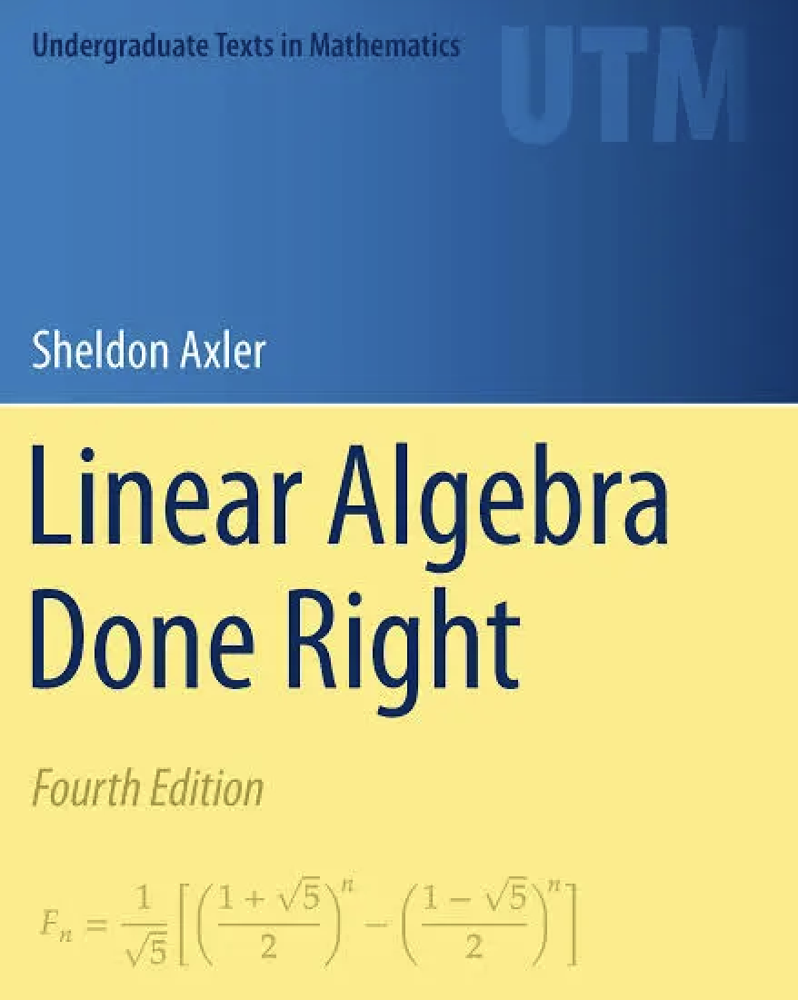

# Math 110: Linear Algebra

**UC Berkeley | Spring 2026**

<p align="center">
  
</p>

> *"The study of linear algebra is a beautiful subject in its own right."*
> — Sheldon Axler

Course materials for Math 110, based on *Linear Algebra Done Right* (4th edition) by Sheldon Axler.

---

## Overview

This repository contains exercise worksheets, lecture notes, and study materials for UC Berkeley's Math 110 course. The course covers core topics in linear algebra including vector spaces, linear maps, eigenvalues, and inner product spaces.

**Instructor:** TBD
**Office Hours:** TBD

---

## Repository Structure

```
math110/
├── style-guide.tex           # LaTeX formatting reference
├── lec/                      # Weekly lecture notes (PDF)
├── textbook/
│   ├── exercises/            # Chapter exercise worksheets
│   ├── notes/                # Personal study notes
│   └── README.md             # Homework assignments
└── slc/                      # SLC review packets
    ├── VecSpaceLinMapsPacket.pdf
    ├── EigenTheoryPacket.pdf
    ├── InnerProductsPacket.pdf
    ├── Midterm Review Packet.pdf
    └── Math110FinalsPacket.pdf
```

---

## Chapter Progress

| Chapter | Topic | Exercises | Status |
|---------|-------|-----------|--------|
| 1A | R^n and C^n | 6 problems | Complete |
| 1B | Definition of Vector Space | 7 problems | Complete |
| 1C | Subspaces | 17 problems | Complete |
| 2A | Span and Linear Independence | TBD | In Progress |
| 2B | Bases | TBD | Not Started |
| 2C | Dimension | TBD | Not Started |

---

## Building Documents

Compile LaTeX files using:

```bash
pdflatex <filename>.tex
```

For documents with cross-references, run twice:

```bash
pdflatex <filename>.tex && pdflatex <filename>.tex
```

---

## Resources

| Resource | Link |
|----------|------|
| Course Website | [math.berkeley.edu](https://math.berkeley.edu/courses/math-110) |
| Free Textbook | [linear.axler.net](https://linear.axler.net/) |
| Homework Assignments | [textbook/README.md](./textbook/README.md) |

---

## Acknowledgments

Course materials based on *Linear Algebra Done Right* by Sheldon Axler, available freely at [linear.axler.net](https://linear.axler.net/).
